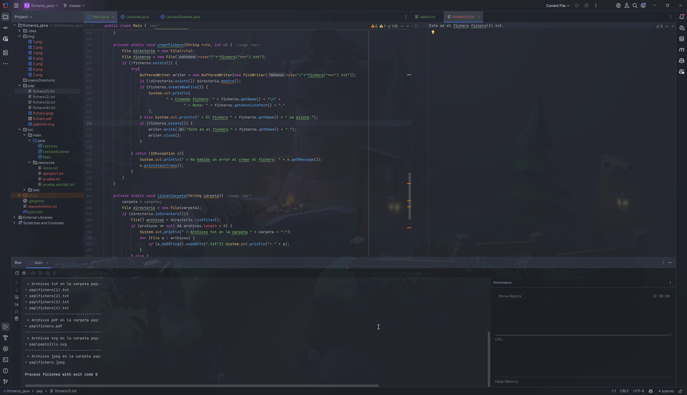

# Ficheros y flujos en Java

[Actividad 1](#actividad-1) | [Actividad 3](#actividad-3) | [Actividad 5](#actividad-5) | [Actividad 7](#actividad-7) | [Actividad 9](#actividad-9)

[Actividad 2](#actividad-2) | [Actividad 4](#actividad-4) | [Actividad 6](#actividad-6) | [Actividad 8](#actividad-8) | [Actividad 10](#actividad-10)

## ACTIVIDAD 1

Modifica el programa para que los archivos se creen en la carpeta *src/main/resources/* a partir de ahora.

Para que se creen en la carpeta, a la hora de crear la clase File, habrá que añadirle la ruta antes del nombre del fichero.
`"src/main/resources/[archivo].txt"`

---

## ACTIVIDAD 2

Añade lógica al ejemplo anterior para que se cree el fichero "*ejemplo1.txt*" y observa que cambia la salida porque ahora lo encuentra.

---

## ACTIVIDAD 3

Abre el fichero manualmente, escribe algo y vuelve a ejecutar tu programa. Observa que haya cambiado la longitud según el número de caracteres que hayas escrito.

---

## ACTIVIDAD 4

Crea un método que debe generar '*n*' archivos: *nombre(1).txt, nombre(2).txt,*... *nombre(n).txt* en la carpeta que se solicite al usuario por pantalla.

---

## ACTIVIDAD 5

Crea un método que reciba una carpeta y liste el contenido de dicha carpeta de aquellos archivos cuya extensión sea *.txt*. Crea una sobrecarga para que el método pueda recibir también el tipo de archivo a listar (.pdf, .jpg, etc,...).

---

## ACTIVIDAD 6

Crea un método que reciba una palabra y permita buscarla en un fichero de texto. Se debe mostrar el número de veces que aparece en el fichero dicha palabra.

---

## ACTIVIDAD 7

Crea un método que haga la misma función que el realizado en la **ACTIVIDAD 6** (contar palabras), pero que vaya leyendo el fichero palabra por palabra con la clase *Scanner*.

---

## ACTIVIDAD 8

Modifica el método creado en la **ACTIVIDAD 2** para que dentro de cada archivo generado se escriba la frase "*Este es el fichero nombre(n).txt*".

---

## ACTIVIDAD 9

Crea un método que reciba un archivo de texto y modifique su contenido, de modo que cada palabra del archivo deberá empezar en mayúscula.

---

## ACTIVIDAD 10

Crea un método que reciba 2 archivos de texto y combine el contenido de los 2 archivos. Para ello, se creará un nuevo archivo donde se debe añadir una palabra de cada archivo de forma consecutiva mientras queden palabras en cada uno de los archivos. Si algún archivo se queda sin palabras, se deben seguir añadiendo todas las palabras que queden en el otro archivo.

